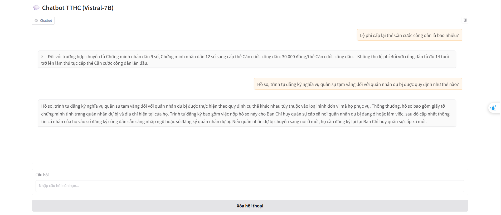
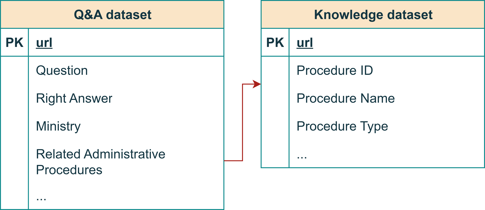
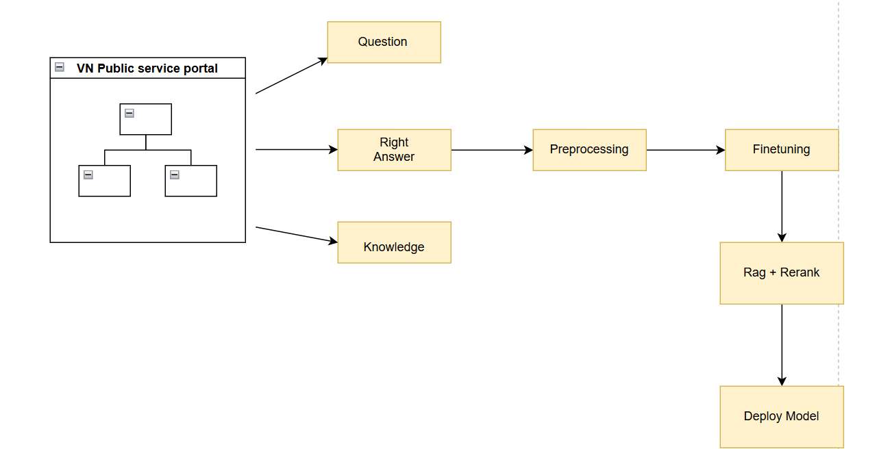

# Chatbot_TTHC
A chatbot for question answering in public services, implemented using Retrieval-Augmented Generation (RAG) with a reranker and the Vistral 7B model.


## Features
- **RAG Architecture**: Combines retrieval-based and generative models for more reliable answers.
- **Reranker Integration**: Improves the relevance of retrieved documents before generation.
- **Vistral 7B Model**: A powerful LLM used to generate natural and accurate responses.
- **Domain-specific Dataset**: Focused on public service procedures (TTHC).
### 1. Chatbot Main Interface


### 2. English Evaluation Result (ER)


### 3. Model Performance Screenshot



## 🔧 Installation
```bash
# Clone the repository
git clone https://github.com/TienNhat5103/Chatbot_TTHC.git
cd Chatbot_TTHC

# Install dependencies
pip install -r A_crawl/requirements.txt